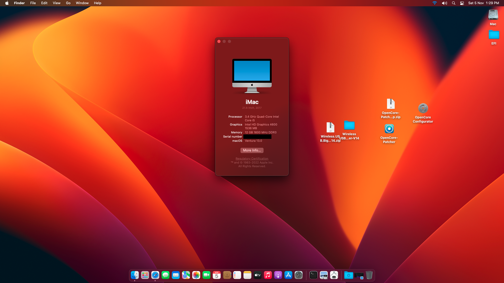

# Ventura-Hackintosh-Haswell-EFI

# Intel Core i5-4670 - Ventura Hackintosh EFI (Opencore 0.9.4)
## Configuration

| Specifications | Details                                                  |
| ------------------- | ------------------------------------------- |
| MotherBoard     | Intel Original DH87MC      					|
| Processor           | Intel Core i5-4670 Processor    		    |
| Graphics | Intel HD 4600 (https://github.com/dortania/OpenCore-Legacy-Patcher/)              |
| Audio          | Realtek ALC892 audio (ALCID=1)            |
| Boot-Args | -v keepsyms=1 debug=0x100 alcid=1 amfi_get_out_of_my_way=0x1 ipc_control_port_options=0 |

## Note
- amfi_get_out_of_my_way=0x1 - Add To fix Haswell graphics fix using OCLP
- ipc_control_port_options=0 - Add to fix crashing issue of some apps(Skype, Whatsapp, Spotify, etc)
  
## Disable SIP follow below steps before run OCLP (If OCLP complains about SIP)
 - sudo spctl --master-disable 
 - restart, on recovery, choose ultility, terminal add:
 - csrutil disable
 - csrutil authenticated-root disable
 - restart
 - Run opencore legacy patcher 

## Improvements
- This version was prepared using OpenCore 0.8.5 for MacOS Ventura.
